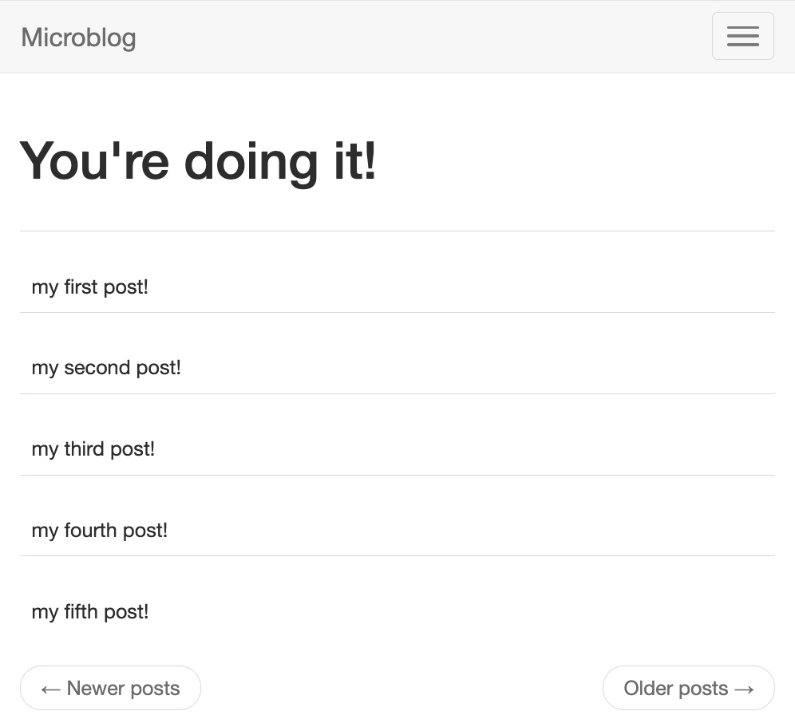

# Welcome to Wellfound's microblog assessment!

## Goal

Your task is to update the home page of this Flask app to display all of the rows in the blog posts table instead of just the static single row.

Clone/fork this repository and make a commit with this change. After you've made your changes, please take a screenshot of the updated home page and include it in the README of your public repository. Finally, email the link to your public repository to clayton.bridge@wellfound.co, and please include your full name in the email!

  

## Contributions

Feel free to clone this repo locally and use your own editor of choice.

If you would rather use the Gitpod development environment for this app:

- Change the dropdown that says "Web IDE" to "Gitpod" (if it already says "Gitpod" skip this step)
- Click the button that says "Gitpod"

## Final Submission

Greatly appreciate the brevity of the project. Straight to the point to demonstrate general understanding and very respectful of time!

Some quick notes:

- The new Python 3.10 slim is not compatible with greenlet. I've reverted to 3.9 in the Dockerfile for compatibility.
- Added HMR to the gunicorn cmd for local development
- Added volume mapping between host and container for local development
- Added docker compose to standardize local development

To spin up the container, simply run `docker compose up --build` (build switch optional)

